# TARDIS

[GitHub Repository](https://github.com/Hyp3R0d/TARDIS) · [main branch](https://github.com/Hyp3R0d/TARDIS/tree/main)

## Transport-Aligned Residual Diffusion in Innovation Subspaces

TARDIS 是一个面向连续视频生成的完整工程：GPU 服务端负责训练、验证、评测和 prompt-only 推理；`web-server` 提供轻量 HTTP 服务和 nginx 前置，可作为 SSH 反向代理服务的运维前置；`tardis-client` 提供可在 Windows 上运行的 Electron 桌面创作客户端。

项目的核心原则是：

> 先传输可预测世界，再只扩散不可预测事件。

相邻视频帧中的背景、主体和纹理通常可以由历史状态和运动传输解释。TARDIS 先把上一帧生成状态对齐到当前坐标系，再在传输轨道的法向创新子空间中进行稀疏残差扩散，将预算集中到真正需要更新的区域。

本仓库是将原 `backbone_server` 内容提升到项目根目录后的统一交付版本。服务端代码现在位于根目录的 `tardis/`、`scripts/`、`tests/` 等目录中；没有保留空的 `backbone_server/` 壳目录。

## 推理视觉结果（主要展示）

本节放置项目最核心的推理视觉证据，且批量 rollout 优先展示。素材覆盖 12 个批量生成场景、九类写实/动画/电影化 TARDIS 风格，以及三个场景上的同 prompt 多模型对照。所有帧均来自交付证据包或实机推理结果；clean/annotated 用于可读性和时序质量检查，不替代完整 test split 的数值评测。annotated 帧中的彩色框标出人物、物体和场景区域，并给出 LPIPS/TC 观察标签。

### 1. 12 个批量推理场景

下列 GIF 是从 `document_materials/perform/videos_20s/` 的 12 个批量推理 MP4 中截取的约 3 秒预览，覆盖赛博朋克街景、雨巷、科幻机甲、月面实验室、油画海岸、手绘森林、动作片、像素 RPG、野生动物、仙侠悬崖和日式动画。每个 GIF 使用绝对 `raw.githubusercontent.com` 地址，并附带静态 JPG 海报入口：在不支持动画或网络暂时阻塞 GIF 的 Markdown 客户端中，海报仍可打开；点击 GIF 可直接查看原始动画。

| 场景与 GIF 预览 | 场景与 GIF 预览 |
| --- | --- |
| Cyberpunk city<br><br><sub>[静态海报](docs/demo/batch/s01_cyberpunk_neon_city_20s.jpg) · [打开 GIF](https://raw.githubusercontent.com/Hyp3R0d/TARDIS/main/docs/demo/batch/gif/s01_cyberpunk_neon_city_20s.gif)</sub> | Rain alley<br><br><sub>[静态海报](docs/demo/batch/s02_cyberpunk_rain_alley_v7_20s.jpg) · [打开 GIF](https://raw.githubusercontent.com/Hyp3R0d/TARDIS/main/docs/demo/batch/gif/s02_cyberpunk_rain_alley_v7_20s.gif)</sub> |
| Sci-fi mecha<br><br><sub>[静态海报](docs/demo/batch/s03_hardcore_sci_fi_mecha_20s.jpg) · [打开 GIF](https://raw.githubusercontent.com/Hyp3R0d/TARDIS/main/docs/demo/batch/gif/s03_hardcore_sci_fi_mecha_20s.gif)</sub> | Lunar lab<br><br><sub>[静态海报](docs/demo/batch/s04_rover_lunar_lab_20s.jpg) · [打开 GIF](https://raw.githubusercontent.com/Hyp3R0d/TARDIS/main/docs/demo/batch/gif/s04_rover_lunar_lab_20s.gif)</sub> |
| Oil seaside<br><br><sub>[静态海报](docs/demo/batch/s05_classical_oil_seaside_walk_20s.jpg) · [打开 GIF](https://raw.githubusercontent.com/Hyp3R0d/TARDIS/main/docs/demo/batch/gif/s05_classical_oil_seaside_walk_20s.gif)</sub> | Fantasy forest<br><br><sub>[静态海报](docs/demo/batch/s06_handpainted_fantasy_forest_20s.jpg) · [打开 GIF](https://raw.githubusercontent.com/Hyp3R0d/TARDIS/main/docs/demo/batch/gif/s06_handpainted_fantasy_forest_20s.gif)</sub> |
| Action thriller<br><br><sub>[静态海报](docs/demo/batch/s07_hollywood_action_thriller_20s.jpg) · [打开 GIF](https://raw.githubusercontent.com/Hyp3R0d/TARDIS/main/docs/demo/batch/gif/s07_hollywood_action_thriller_20s.gif)</sub> | Pixel RPG<br><br><sub>[静态海报](docs/demo/batch/s08_pixel_art_rpg_forest_castle_20s.jpg) · [打开 GIF](https://raw.githubusercontent.com/Hyp3R0d/TARDIS/main/docs/demo/batch/gif/s08_pixel_art_rpg_forest_castle_20s.gif)</sub> |
| Arctic wolf<br><br><sub>[静态海报](docs/demo/batch/s09_wildlife_arctic_wolf_fullbody_v3_10s.jpg) · [打开 GIF](https://raw.githubusercontent.com/Hyp3R0d/TARDIS/main/docs/demo/batch/gif/s09_wildlife_arctic_wolf_fullbody_v3_10s.gif)</sub> | Xianxia cliff<br><br><sub>[静态海报](docs/demo/batch/s10_xianxia_cliff_20s.jpg) · [打开 GIF](https://raw.githubusercontent.com/Hyp3R0d/TARDIS/main/docs/demo/batch/gif/s10_xianxia_cliff_20s.gif)</sub> |
| Japan animation<br><br><sub>[静态海报](docs/demo/batch/s011_animation_japan_5s.jpg) · [打开 GIF](https://raw.githubusercontent.com/Hyp3R0d/TARDIS/main/docs/demo/batch/gif/s011_animation_japan_5s.gif)</sub> | Wildlife close-up<br><br><sub>[静态海报](docs/demo/batch/s012_wildlife_arctic_wolf_v2_10s.jpg) · [打开 GIF](https://raw.githubusercontent.com/Hyp3R0d/TARDIS/main/docs/demo/batch/gif/s012_wildlife_arctic_wolf_v2_10s.gif)</sub> |

批量 GIF 统一压缩为 480×270、约 3 秒的 README 友好版本；原始 MP4 不复制进仓库。批量视频的 prompt 与文件名对应关系见交付资料中的 `videos_20s/description/12_video_prompts.txt`。

### 2. 受控视觉对比

下面的对比图使用统一 prompt、seed=42 和帧位置，保持六模型列与相同的画布条件。主展示图优先采用高分辨率三维写实场景，便于直接观察主体边界、背景结构、光影建模以及局部 LPIPS 与 TC 标注。

<div align="center">
  <strong>3D high-fidelity comparison: laboratory, cinematic street, astronaut capsule</strong>
  <br>
  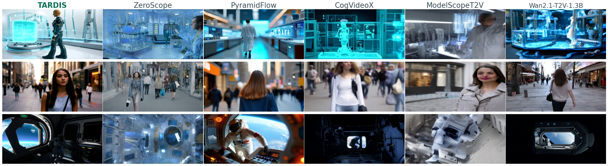
</div>

<div align="center">
  <strong>s05 realistic kitchen</strong>
  <br>
  
</div>

<div align="center">
  <strong>s11 cyberpunk annotated audit</strong>
  <br>
  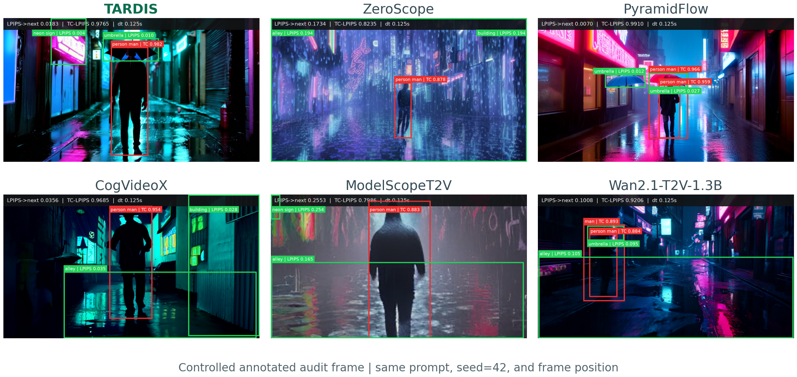
</div>

<div align="center">
  <strong>s15 film-noir comparison</strong>
  <br>
  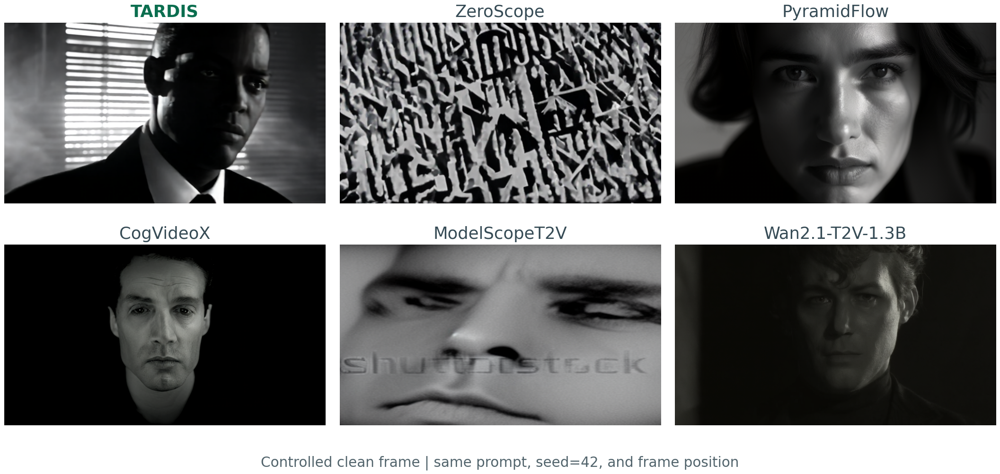
</div>

五个场景的 clean/annotated 交替板（s08 American cartoon living room、s09 clay night market、s10 PVC laboratory、s12 space capsule、s14 pencil cafe）：

<p align="center">
  
</p>

这些图是统一实验条件下的直接栅格导出，不是重新挑选的宣传帧；点击图片即可打开仓库中的原始 PNG。整行拼接板按场景交替展示 clean 与 annotated 结果，彩色框用于定位主体、物体和场景区域。

### 3. 多场景 TARDIS 输出

TARDIS 在现实厨房、电影街景、美式卡通客厅、黏土夜市、科幻实验室、赛博朋克雨巷、太空舱、铅笔画咖啡馆和黑色电影等风格上保持主体、背景与运动结构。每行左侧为 clean 帧，右侧为对应的可解释 annotated 帧。

| 场景 | TARDIS clean | TARDIS annotated |
| --- | --- | --- |
| Realistic photo kitchen |  | 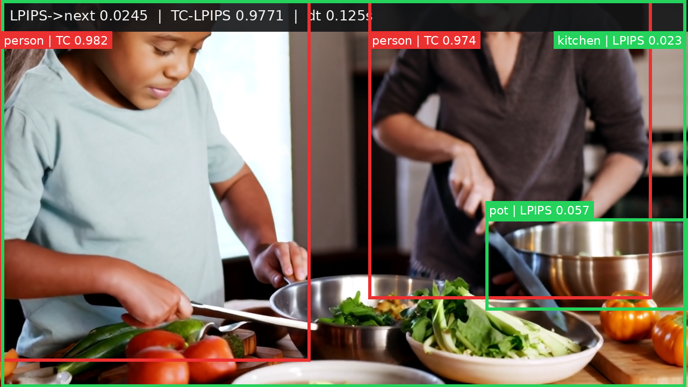 |
| Cinematic photo street |  | 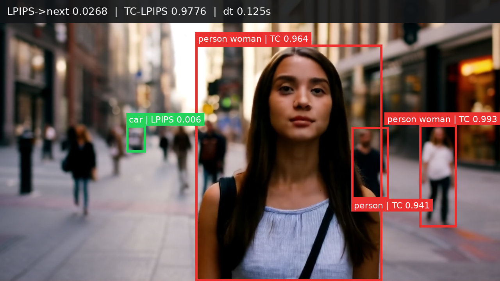 |
| American cartoon living room |  | 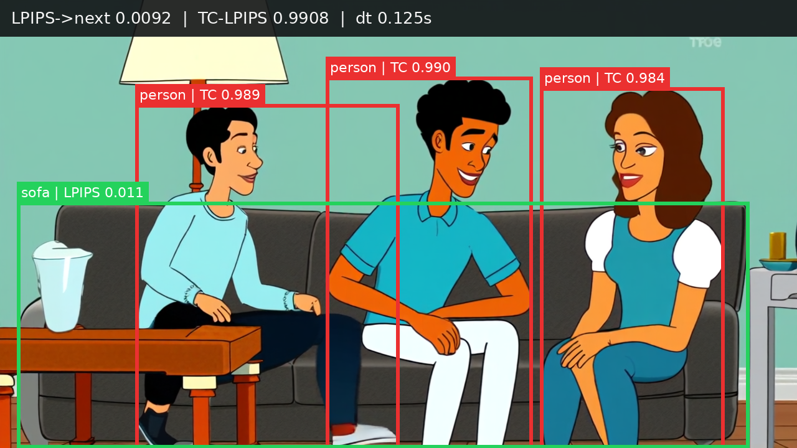 |
| Clay night market |  | 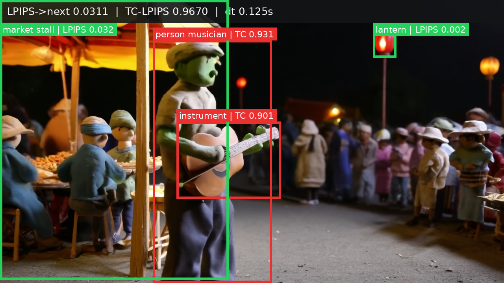 |
| PVC laboratory |  | 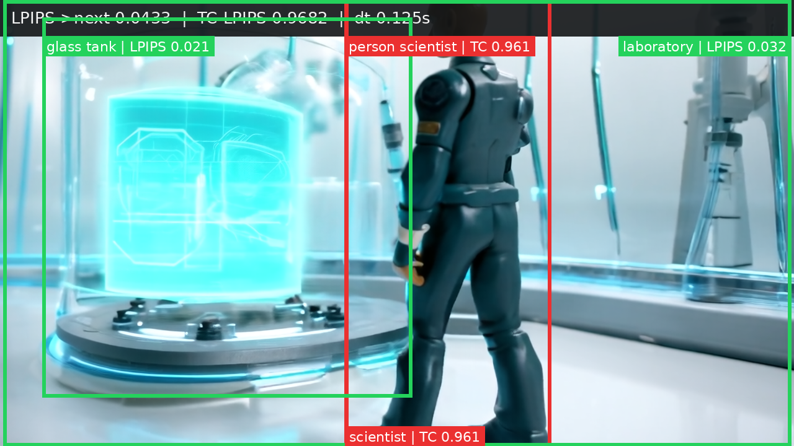 |
| Cyberpunk rain alley |  | 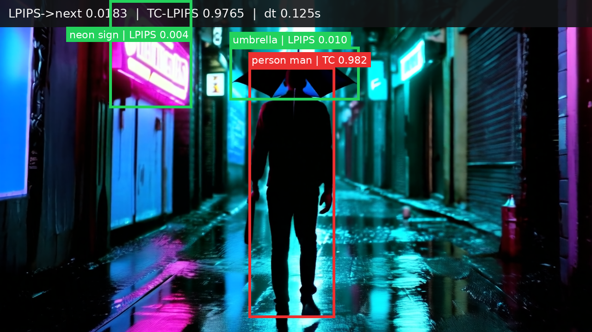 |
| Astronaut capsule |  | 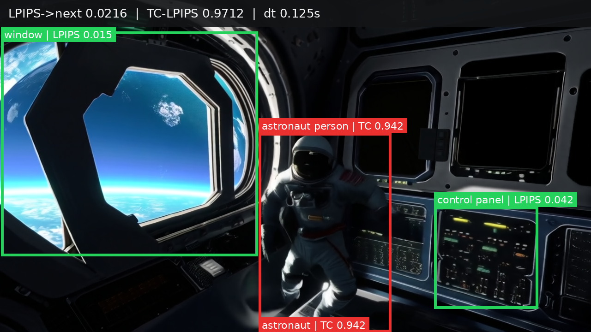 |
| Pencil cafe |  | 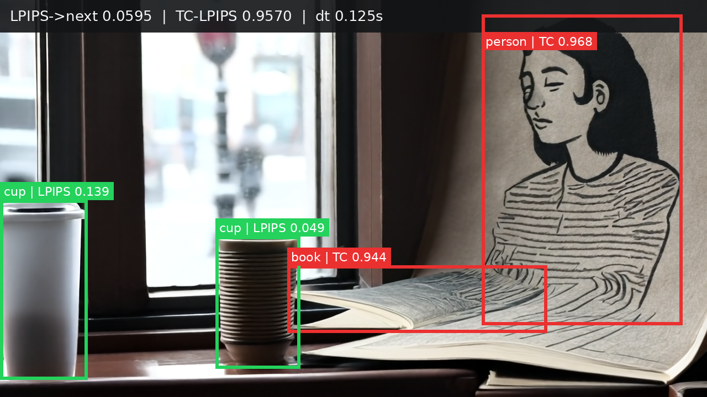 |
| Film noir expression |  | 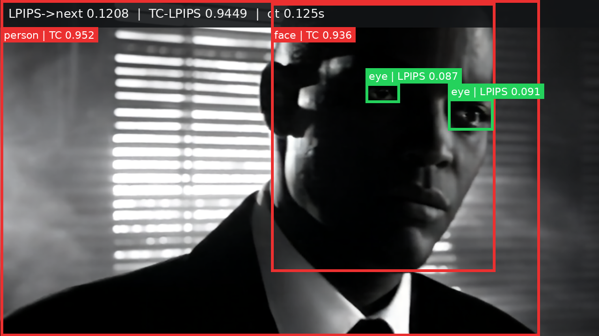 |

clean 帧用于判断风格、构图和细节，annotated 帧用于定位 LPIPS 变化集中在哪些局部，以及 TC 是否在主体和背景之间保持一致。模型架构、指标定义和完整实验协议见项目文档；这里保留原始 PNG，便于放大检查。

### 4. 同一 prompt 的外部模型对照

下面三组使用相同 prompt 和画布条件，分别对应现实厨房、赛博朋克雨巷和黑色电影表情。每组以紧凑网格列出 TARDIS 和五个视觉对比模型，便于并排比较主体稳定性、局部细节与背景连续性。

#### Realistic photo kitchen

| **TARDIS** | **ZeroScope v2 576w** | **Pyramid Flow miniFLUX** |
| --- | --- | --- |
|  | 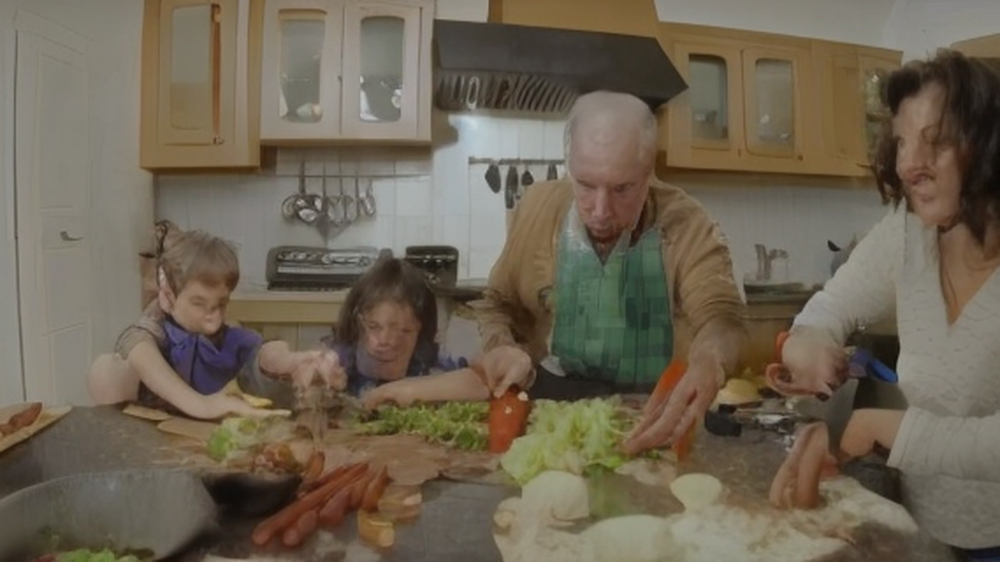 |  |
| **Transformer-T2V 2B** | **ModelScope T2V 1.7B** | **Wan2.1 T2V 1.3B** |
|  |  |  |

#### Cyberpunk rain alley

| **TARDIS** | **ZeroScope v2 576w** | **Pyramid Flow miniFLUX** |
| --- | --- | --- |
|  |  |  |
| **Transformer-T2V 2B** | **ModelScope T2V 1.7B** | **Wan2.1 T2V 1.3B** |
|  |  |  |

#### Film noir expression

| **TARDIS** | **ZeroScope v2 576w** | **Pyramid Flow miniFLUX** |
| --- | --- | --- |
|  |  |  |
| **Transformer-T2V 2B** | **ModelScope T2V 1.7B** | **Wan2.1 T2V 1.3B** |
| 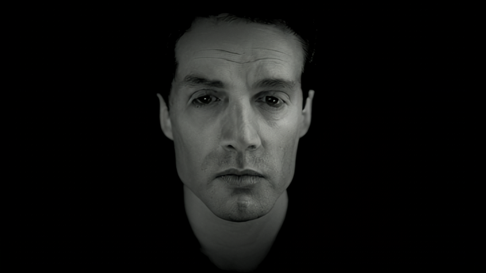 |  |  |

视觉对比模型与单一引用链接如下：

| 视觉对比模型 | 引用 |
| --- | --- |
| ZeroScope v2 576w | [模型页面](https://huggingface.co/cerspense/zeroscope_v2_576w) |
| Pyramid Flow miniFLUX | [项目页面](https://github.com/jy0205/Pyramid-Flow) |
| Transformer-T2V 2B | [论文与模型说明](https://arxiv.org/abs/2408.06072) |
| ModelScope Text-to-Video 1.7B | [模型页面](https://huggingface.co/ali-vilab/text-to-video-ms-1.7b) |
| Wan2.1 T2V 1.3B | [项目页面](https://github.com/Wan-Video/Wan2.1) |

完整素材说明保留在 [`docs/demo/model_sources.txt`](docs/demo/model_sources.txt)。

## 实机演示

以下 GIF 是从交付目录中的真实录屏 MP4 截取的短片段，均标记为客户端/服务端演示结果。GIF 仅用于 README 展示，原始录屏仍保存在项目外的 `document_materials/perform/` 中。

| 训练与服务端 | Web/SSH 反向代理服务 | 推理评测 |
| --- | --- | --- |
|  |  |  |

桌面端创作流程（参考图预览、提交、轮询和结果归档）：


客户端静态演示截图：

| 参考图与参数 | 生成中 | 生成结果与归档 |
| --- | --- | --- |
| 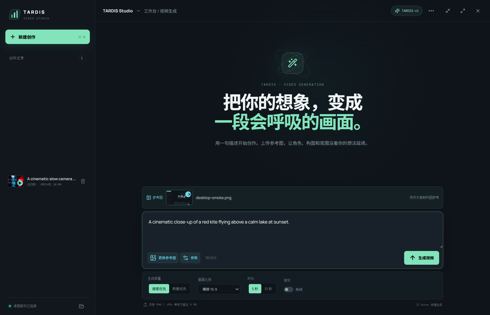 | 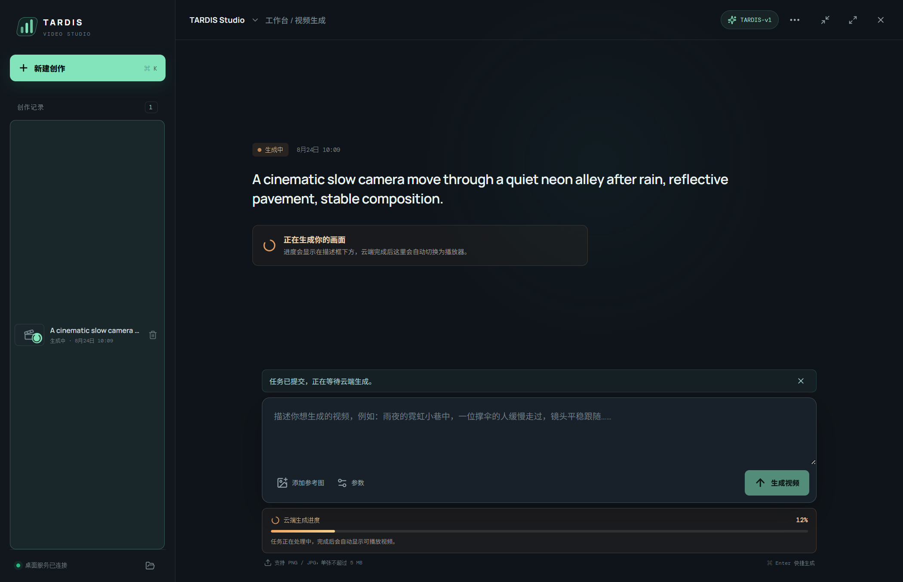 | 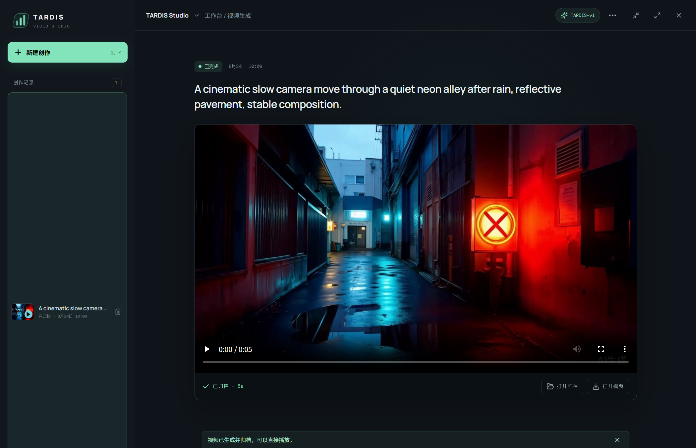 |

演示素材索引：

| 原始素材（交付目录外） | README 展示副本 |
| --- | --- |
| `document_materials/perform/train.mp4` | `docs/demo/runtime/training-console.gif` |
| `document_materials/perform/web_server.mp4` | `docs/demo/runtime/ssh-reverse-proxy.gif` |
| `document_materials/perform/infer.mp4` | `docs/demo/runtime/inference-console.gif` |
| `document_materials/perform/TARDIS_Client_Demo_Results/` | `docs/demo/client/` |
| `document_materials/perform/videos_20s/*.mp4` | `docs/demo/batch/gif/*.gif` |

原始 MP4 和客户端演示截图保留在交付资料目录中；仓库只保留压缩后的 GIF、PNG 和 JPG，避免把大文件写入源码仓库。批量视频的 prompt 与文件名对应关系见交付资料中的 `videos_20s/description/12_video_prompts.txt`。

## 部署与接口速查

本节是 README 级别的可复制入口；字段级约束、错误包络和安全边界以仓库外的
`API.md`（TARDIS 推理服务端 v1 契约）为准。训练与推理使用不同节点：训练节点为
NVIDIA RTX 4090（24 GB），推理节点为 NVIDIA RTX 5060（8 GB）。正式配置固定为
Python 3.12、PyTorch 2.8、bf16 AMP、16 帧训练 clip、两步 endpoint update、batch 1、
active ratio 0.35、VAE slicing 和因果状态缓存；训练使用 micro batch 1、梯度累计 4、
EMA 0.999、gradient checkpointing，验证集 TC/LPIPS 加权分数选择 `best.pt`。

```bash
cd /path/to/project
python3.12 -m venv .venv && source .venv/bin/activate
python -m pip install -e .
export TARDIS_STORAGE_ROOT=/root/autodl-tmp/TARDIS
export TARDIS_DATASETS_FILE=/path/to/project/datasets.txt
TARDIS_DATASET=dataverse bash scripts/train.sh
TARDIS_DATASET=dataverse TARDIS_CHECKPOINT=$TARDIS_STORAGE_ROOT/checkpoints/dataverse/<run>/best.pt bash scripts/infer.sh
TARDIS_DATASET=dataverse TARDIS_CHECKPOINT=$TARDIS_STORAGE_ROOT/checkpoints/dataverse/<run>/best.pt \
  TARDIS_PROMPT='A cinematic robot walks through a rainy neon street' bash scripts/apply.sh
```

### 预训练衔接、后训练与微调

像素生成先验（VAE、文本编码器和首帧先验）以冻结权重加载；本仓库训练的是时域增量参数，包括 `motion`、`transport`、`state`、`router`、`lite_corrector`、`keyframe_residual_dit`、residual teacher/student 和 `metric_adapter`。三个数据集分别建立运行目录、优化器状态和 EMA，禁止在同一训练进程中混合数据源。正式数据契约为 `512x512`、16 帧窗口、30 FPS metadata、split seed `3407`。

| 阶段 | 可训练模块 | 输入窗口 | 作用 |
| --- | --- | ---: | --- |
| 预训练衔接 | `keyframe_residual_dit`、`lite_corrector` | 1 帧 | 从 identity-preserving 初值启动增量分支 |
| 时序适配 | motion、transport、state、lite | 16 帧 | 学习运动传播、可见性和状态更新 |
| 后训练 | router、residual teacher/student、metric adapter 逐阶段解冻 | 16 帧 | 闭环、因果蒸馏以及 TC/LPIPS 对齐 |
| 部署推理 | EMA shadow（无梯度） | 16 帧或按时长展开 | 两步 endpoint 轨迹生成 MP4 |

后训练由 `scripts/train.sh` 统一承载，不需要另一个训练服务。`TARDIS_TRAIN_MODE` 选择参数所有权：`keyframe_only` 只训练关键帧残差 DiT 和轻量校正器，`full_temporal` 训练完整时域模块；`TARDIS_CURRICULUM_PROFILE` 可选 `full`、`transport`、`closed_loop_motion` 或 `metric_alignment`，用于完整课程或针对性诊断。后训练以 optimizer step 计数，默认 `20 x 64 / 4 = 320` 步，课程比例固定为 `5%/5%/10%/20%/20%/40%`：

| 课程阶段 | 预算 | teacher forcing | residual steps | 新增目标 |
| --- | ---: | ---: | ---: | --- |
| `transport_warmup` | 5% | 1.00 | 0 | diffusion、transport、flow、visibility、lite |
| `router_calibration` | 5% | 1.00 | 0 | risk field、survival 和 active-token budget |
| `residual_teacher` | 10% | 1.00 | 4 | 法向创新残差教师 |
| `closed_loop` | 20% | 1.00 → 0.25 | 4 | 自身历史状态、warp consistency、long-term drift |
| `crcd` | 20% | 0.25 → 0 | 1 | teacher/student 因果残差蒸馏 |
| `metric_alignment` | 40% | 0 | 1 | TC、LPIPS、文本对齐和 `metric_adapter`；选择 `best.pt` |

#### P0：关键帧衔接

```bash
cd /path/to/project
source .venv/bin/activate
export TARDIS_STORAGE_ROOT=/root/autodl-tmp/TARDIS
export TARDIS_DATASETS_FILE=/path/to/project/datasets.txt
export TARDIS_CHECKPOINT_ROOT="$TARDIS_STORAGE_ROOT/checkpoints"
export TARDIS_OUTPUT_ROOT="$TARDIS_STORAGE_ROOT/outputs"
TARDIS_DATASET=dataverse \
TARDIS_TRAIN_MODE=keyframe_only \
TARDIS_CURRICULUM_PROFILE=transport \
TARDIS_EPOCHS=4 TARDIS_STEPS_PER_EPOCH=64 \
TARDIS_MICRO_BATCH_SIZE=1 TARDIS_GRADIENT_ACCUMULATION_STEPS=4 \
TARDIS_VALIDATION_BATCH_SIZE=2 TARDIS_PRECISION=bf16 \
bash scripts/train.sh
```

#### P1：完整时序后训练

```bash
TARDIS_DATASET=dataverse \
TARDIS_WARM_START="$TARDIS_CHECKPOINT_ROOT/dataverse/<p0-run>/best.pt" \
TARDIS_WARM_START_USE_EMA=1 \
TARDIS_TRAIN_MODE=full_temporal TARDIS_CURRICULUM_PROFILE=full \
TARDIS_EPOCHS=20 TARDIS_STEPS_PER_EPOCH=64 \
TARDIS_MICRO_BATCH_SIZE=1 TARDIS_GRADIENT_ACCUMULATION_STEPS=4 \
TARDIS_VALIDATION_BATCH_SIZE=2 TARDIS_NUM_FRAMES=16 \
TARDIS_DIFFUSION_STEPS=2 TARDIS_ACTIVE_RATIO=0.35 \
TARDIS_EMA_DECAY=0.999 bash scripts/train.sh
```

将 `TARDIS_DATASET` 替换为 `openvid` 或 `seedance` 即可分别训练另外两个数据集。`TARDIS_WARM_START` 只加载权重，不恢复优化器；精确续训则使用 `TARDIS_RESUME`，并要求数据集、world size、结构签名和精度完全一致：

```bash
TARDIS_DATASET=openvid \
TARDIS_RESUME="$TARDIS_CHECKPOINT_ROOT/openvid/<run>/latest.pt" \
TARDIS_PRECISION=bf16 bash scripts/train.sh
```

跨数据集 warm-start 是显式的 CLI 接口，而不是脚本环境变量。需要时直接调用训练模块并传入 `--allow-cross-dataset-warm-start`；同数据集 warm-start 不需要该开关：

```bash
torchrun --standalone --nproc_per_node=1 -m tardis.cli.train \
  --dataset openvid --datasets-file "$TARDIS_DATASETS_FILE" \
  --warm-start "$TARDIS_CHECKPOINT_ROOT/dataverse/<run>/best.pt" \
  --allow-cross-dataset-warm-start \
  --curriculum-profile metric_alignment --train-mode full_temporal \
  --precision bf16 --epochs 6 --steps-per-epoch 64 \
  --micro-batch-size 1 --gradient-accumulation-steps 4 \
  --validation-batch-size 2
```

后训练的主要可调接口如下；其余模型结构参数仍沿用本节上方的统一训练参数，并且必须与 checkpoint 签名一致：

| 参数 | 默认值 | 接口语义 |
| --- | ---: | --- |
| `TARDIS_TRAIN_MODE` | `full_temporal` | `keyframe_only` 或 `full_temporal` |
| `TARDIS_CURRICULUM_PROFILE` | `full` | 完整、transport、闭环或指标对齐课程 |
| `TARDIS_WARM_START` | 空 | 只加载指定 checkpoint 权重 |
| `TARDIS_WARM_START_USE_EMA` | `1` | warm-start 使用 EMA shadow |
| `TARDIS_RESUME` | 空 | 恢复 optimizer、scheduler、AMP scaler、EMA、课程游标和 RNG |
| `TARDIS_EPOCHS` / `TARDIS_STEPS_PER_EPOCH` | `20 / 64` | 总课程预算来源 |
| `TARDIS_MICRO_BATCH_SIZE` | `2` | 每卡 micro-batch；正式后训练常设为 `1` |
| `TARDIS_GRADIENT_ACCUMULATION_STEPS` | `2` | 梯度累计；正式后训练常设为 `4` |
| `TARDIS_VALIDATION_BATCH_SIZE` | `8` | 完整 validation 的批大小 |
| `TARDIS_EMA_DECAY` | `0.999` | 时域参数 EMA 衰减，冻结先验不进入 shadow |
| `TARDIS_TC_LOSS_WEIGHT` / `TARDIS_LPIPS_LOSS_WEIGHT` | `5.0 / 3.0` | `metric_alignment` 的双目标权重 |
| `TARDIS_CRCD_LOSS_WEIGHT` | `1.0` | 因果残差蒸馏权重 |
| `TARDIS_PRECISION` | `bf16` | `bf16`、`fp16` 或 `fp32`；`fp16` 才启用 GradScaler |

AdamW 使用 learning rate `1e-4`、weight decay `1e-2`、warmup `64` steps、global-norm clipping `1.0`；验证时临时交换 EMA 参数，完整 validation 上 TC/LPIPS 组合分数改善才更新 `best.pt`。test split 不参与后训练、early stopping、调参或权重选择。训练完成后沿用本 README 的 `infer.sh` 和 `apply.sh` 接口，默认加载 EMA checkpoint；运行记录应保存 run manifest、数据 manifest hash、结构签名、checkpoint SHA-256、TC/LPIPS 以及资源统计。

桌面客户端只访问本机代理 `http://127.0.0.1:8787`；代理再向 TARDIS 推理服务端发起
HTTPS 请求，密钥只放在服务端环境变量或桌面端安全存储中。上行创建任务的最小字段为
`prompt`（必填，最长 512 字符）、可选 `imageData`（PNG/JPEG Data URL，解码后不超过
5 MB）和 `settings`（`quality`、`size`、`fps`、`duration`、`withAudio`）。本地接口为：

```http
POST http://127.0.0.1:8787/api/generations
Content-Type: application/json

{"prompt":"A cinematic robot walks through a rainy neon street",
 "imageData":"data:image/png;base64,...",
 "settings":{"quality":"speed","size":"1280x720","fps":30,"duration":5,"withAudio":false}}
```

返回 `id`、`requestId`、`taskStatus` 和 `model`；客户端随后轮询：

```http
GET http://127.0.0.1:8787/api/generations/{task-id}
```

下行状态统一为 `PROCESSING`、`SUCCESS` 或 `FAIL`。成功时返回临时 `videoUrl`、
`coverUrl` 和元数据，客户端立即下载为 `video.mp4`、`cover.jpg`、`manifest.json`。
服务端规范接口对应 `POST /tardis/v1/videos`、`GET /tardis/v1/videos/{id}`、
`GET /tardis/v1/videos/{id}/content`；请求使用 `Authorization: Bearer <token>`、
`Content-Type: application/json`、`X-Request-ID` 和建议的 `Idempotency-Key`。创建成功
返回 `202`，状态接口返回 `queued/running/succeeded/failed/cancelled`，建议每 2--5 秒
轮询并遵循 `Retry-After`；常见故障为 `401/403/404/409/422/429/503/504`。

公网节点的 `web-server` 只负责 JDK HTTP 运维接口和 Nginx 前置，不承载 GPU 推理。
默认应用端口为 `8080`、Nginx 端口为 `80`（生产环境改为 TLS `443`），核心配置为：

```nginx
upstream tardis_app { server 127.0.0.1:8080; keepalive 16; }
server {
  listen 80;
  location / { proxy_pass http://tardis_app; proxy_http_version 1.1;
    proxy_set_header Host $host; proxy_set_header X-Request-ID $request_id;
    proxy_set_header X-Forwarded-For $proxy_add_x_forwarded_for; }
  location /tardis/ { proxy_pass http://127.0.0.1:18080/;
    proxy_buffering off; proxy_read_timeout 120s; }
}
```

GPU 主机通过 SSH 反向隧道主动出站，网关只监听回环端口：

```bash
ssh -NT -o ExitOnForwardFailure=yes -o ServerAliveInterval=30 \
  -o ServerAliveCountMax=3 -R 127.0.0.1:18080:127.0.0.1:8000 \
  tunnel@gateway.example.com
```

启动运维前置：`cd web-server && mvn package && java -jar target/tardis-webserver.jar`；
容器方式为 `docker compose up --build`。SSH 账号应仅允许受限 remote forwarding，
公网不暴露 GPU 端口、管理端点或本地绝对路径。

## 系统总览

仓库包含两条彼此独立的运行链路。桌面创作链路面向在线视频生成，使用客户端内置的 Express 代理访问 TARDIS 推理服务端；GPU 研究链路面向 TARDIS 的训练、评测和 prompt-only 推理，直接运行根目录下的 Python CLI。`web-server` 是可选的 HTTP/运维前置，不是当前客户端的生成 API，也不包含 GPU 推理代码。

```
桌面创作链路（在线视频 API）
┌──────────────────────────┐   loopback :8787   ┌────────────────────────────┐
│ tardis-client (Electron) │ ─────────────────> │ tardis-client/server        │
│ prompt / reference /     │                    │ Express proxy              │
│ polling / player /       │ <───────────────── │ API key kept server-side   │
│ local archive            │   video + status   └──────────────┬─────────────┘
└──────────────────────────┘                                  │ HTTPS
                                                               ▼
                                                    TARDIS 推理服务端 API

GPU 研究链路（本地或远端 GPU）
┌───────────────────────┐   ┌──────────────────────────┐   ┌─────────────────────┐
│ scripts/train.sh      │──>│ tardis.cli.train         │──>│ checkpoints + logs  │
│ scripts/infer.sh      │──>│ tardis.cli.infer         │──>│ metrics + showcases │
│ scripts/apply.sh      │──>│ tardis.cli.apply         │──>│ MP4 + JSON          │
└───────────────────────┘   │ frozen prior + TARDIS    │   └─────────────────────┘
                            │ TAR / TOQ / IRF-DIS / CIOD│
                            └──────────────────────────┘

可选 SSH 反向代理服务/运维层
┌──────────────────────┐       ┌──────────────┐
│ web-server :8080     │ <──── │ nginx :80    │
│ static / health /    │       │ proxy_pass   │
│ info / metrics /     │       └──────────────┘
│ admin (Basic Auth)   │
└──────────────────────┘
```

### 三个工程边界

| 组件 | 目录 | 作用 | 默认入口 |
| --- | --- | --- | --- |
| TARDIS GPU 引擎 | 根目录 `tardis/`、`scripts/` | 训练、验证、全量评测、prompt-only 生成 | `bash scripts/train.sh`、`infer.sh`、`apply.sh` |
| SSH 反向代理服务与前置服务 | `web-server/` | JDK 17 HTTP 服务、静态资源、健康检查、指标、限流、Basic Auth、nginx 反代；不提供 `/api/generations` | `scripts/start.ps1` 或 Docker Compose |
| 桌面客户端 | `tardis-client/` | prompt、参考图、进度轮询、播放、创作记录和本地归档 | `npm run desktop:dev` 或打包 EXE |

服务端本体是 GPU 上的 Python CLI/推理引擎，不是 FastAPI/Flask 常驻 HTTP API。客户端的生成请求由 `tardis-client/server` 直接转发到 TARDIS 推理服务端的异步接口；`web-server` 只承担静态资源和运维接口。若云端部署需要长期 HTTP 入口或反向 SSH 通道，应在部署环境中额外配置受限隧道，并明确映射到实际 API 服务。

## TARDIS 方法

TARDIS 将时序生成拆成两个互补部分：

1. **TAR（Transport-Aligned Residualization）**：从文本和因果状态预测运动，传输上一帧 latent、短期状态和 anchor，并构造当前帧相对于 transport prior 的残差。
2. **DIS（Diffusion in Innovation Subspaces）**：通过可见性校准的创新风险路由器选择 active patch，将残差投影到 transport orbit 的法向子空间，仅对风险区域的创新 token 运行稀疏 residual DiT。

推理闭环：

```
prompt
  -> frozen text encoder / TARDIS first-frame prior
  -> frame 0
  -> prompt-conditioned motion scaffold
  -> motion/state transport
  -> transport-orbit quotient projector
  -> innovation risk field + proper time
  -> lite tangent corrector + sparse normal residual diffusion
  -> causal state update
  -> next frame
```

主要模块位于 `tardis/models/`：

| 模块 | 责任 |
| --- | --- |
| `priors.py` | 冻结 VAE、文本编码器和首帧图像先验 |
| `motion.py` | source-motion teacher 与 prompt-conditioned motion scaffold |
| `transport.py` | latent warp、visibility 加权、历史状态传输 |
| `quotient.py` | transport Jacobian 轨道、tangent/normal 残差分解 |
| `router.py`、`clock.py` | 创新风险、active patch 和事件时间预算 |
| `residual.py` | lite tangent corrector 与 sparse residual DiT |
| `state.py` | causal state、anchor、scene-cut reset 和长期记忆 |
| `tardis.py`、`factory.py` | 主模型编排与 checkpoint-compatible 装配 |

训练目标同时包含官方 TC、LPIPS、残差扩散、transport、flow/visibility、router、drift、文本和因果创新算子蒸馏项。完整默认值见 `scripts/train.sh` 和 `docs/train.md`。

## 项目结构

```
project/
├── tardis/                  # TARDIS Python package
│   ├── cli/                  # train / infer / apply / runtime
│   ├── data/                 # dataset contracts, manifest, archive, split
│   ├── models/               # TAR, TOQ, IRF/DIS, state updater
│   ├── training/             # objective, losses, curriculum, EMA, distill
│   ├── metrics/              # TC, LPIPS, FVD, FID, CLIPScore, SSIM
│   ├── experiments/          # benchmarks, ablations, diagnostics, reports
│   └── utils/                # checkpoint, video I/O, resources, randomness
├── scripts/                  # deployment-oriented shell entry points
├── docs/                     # train/infer/apply/dataset documentation
│   └── demo/                 # README GIFs and selected visual evidence
├── appendix/                 # archival competition and development documents
│   ├── competition_requirements.md/.pdf
│   └── development_prompt.txt
├── tests/                    # unit and integration tests
├── data/                     # .gitkeep only; large datasets stay on data disk
├── checkpoints/              # .gitkeep only; large weights stay on data disk
├── outputs/                  # .gitkeep only; generated outputs stay on data disk
├── web-server/               # JDK HTTP service and nginx configuration
├── tardis-client/            # Electron + React desktop application
├── datasets.txt              # canonical dataset roots (edit per machine)
├── pyproject.toml            # Python package and dependency contract
├── CITATION.cff              # citation metadata
└── LICENSE                   # Apache License 2.0 for project code
```

## 数据集与 benchmark

项目内部固定使用三个 canonical dataset 名称：

| canonical name | 上游数据源与引用 | 默认 manifest root |
| --- | --- | --- |
| `dataverse` | [Vchitect T2V DataVerse](https://huggingface.co/datasets/Vchitect/Vchitect_T2V_DataVerse) | `Vchitect_T2V_DataVerse` |
| `openvid` | [OpenVid-1M](https://github.com/NJU-PCALab/OpenVid-1M) | `OpenVid-1M` |
| `seedance` | [seedance-2-prompts-datasets](https://github.com/Goku-OpenLab/seedance-2-prompts-datasets) | `seedance-2-prompts-datasets` |

默认 `datasets.txt` 中记录的是：

```
/home/TARDIS/data/Vchitect_T2V_DataVerse
/home/TARDIS/data/OpenVid-1M
/home/TARDIS/data/seedance-2-prompts-datasets
```

部署到其他机器时，推荐复制路径文件并设置 `TARDIS_DATASETS_FILE`，不要把大规模视频复制进 Git。标准 split 使用 train/validation/test 三段，默认 split seed 为 `3407`；记录数和 manifest 版本应以目标数据盘上的 `tardis_manifest.jsonl` 与 `curation_report.json` 为准。

正式 benchmark 设置是 **3 个数据集、TARDIS 与 9 个外部对比基线**：

| # | 方法标识 | SOTA 对比模型与引用 |
| ---: | --- | --- |
| 1 | `animatediff_lightning` | [AnimateDiff-Lightning](https://huggingface.co/ByteDance/AnimateDiff-Lightning) |
| 2 | `sd_turbo_independent` | [SD-Turbo](https://huggingface.co/stabilityai/sd-turbo) 独立逐帧基线 |
| 3 | `text2video_zero` | [Text2Video-Zero](https://github.com/Picsart-AI-Research/Text2Video-Zero) |
| 4 | `streamdiffusion_img2img` | [StreamDiffusion](https://github.com/cumulo-autumn/StreamDiffusion) image-to-video path |
| 5 | `rerender_flow` | [ReRender-A-Video](https://doi.org/10.1145/3610548.3618160) |
| 6 | `tokenflow_core` | [TokenFlow](https://doi.org/10.48550/arXiv.2307.10373) |
| 7 | `vid2vid_zero_core` | [vid2vid-zero](https://github.com/baaivision/vid2vid-zero) |
| 8 | `controlvideo_canny` | [ControlVideo](https://github.com/YBYBZhang/ControlVideo) Canny condition |
| 9 | `stablevideo_propagation` | [StableVideo](https://doi.org/10.1109/ICCV51070.2023.02106) propagation |

后六类通常属于 source-conditioned 对比，不能与 prompt-only `apply` 结果混写。实现和分组位于 `tardis/experiments/benchmark.py`。

## GPU 服务端部署

### 环境

- Linux + NVIDIA CUDA GPU；训练和推理默认使用 `bf16`。
- Python `>=3.12`。
- PyTorch `>=2.8,<2.9`，以及 `diffusers`、`transformers`、`accelerate`、`torchvision`、`av`、`opencv-python-headless`、`lpips`、`open-clip-torch`、`torchmetrics` 等。
- 可访问模型缓存和数据盘；默认基础先验由 TARDIS 推理服务端提供。

安装：

```bash
cd /path/to/project
python3.12 -m venv .venv
source .venv/bin/activate
python -m pip install --upgrade pip
python -m pip install -e .
```

研究/代码质量依赖：

```bash
python -m pip install -e '.[dev]'
```

### 数据盘和缓存

```bash
export TARDIS_STORAGE_ROOT=/root/autodl-tmp/TARDIS
export TARDIS_DATASETS_FILE=/path/to/project/datasets.txt
export TARDIS_CHECKPOINT_ROOT="$TARDIS_STORAGE_ROOT/checkpoints"
export TARDIS_OUTPUT_ROOT="$TARDIS_STORAGE_ROOT/outputs"
export HF_HOME="$TARDIS_STORAGE_ROOT/cache/huggingface"
export TORCH_HOME="$TARDIS_STORAGE_ROOT/cache/torch"
```

默认脚本会设置 `HF_ENDPOINT=https://hf-mirror.com` 和 `HF_HUB_DISABLE_XET=1`；正式实验应记录 manifest、checkpoint SHA-256、模型签名、分辨率、帧数、采样步数、精度和 GPU 型号。

### 训练

标准入口通过脚本位置推导根目录，提升服务端内容后不需要额外改路径：

```bash
cd /path/to/project
source .venv/bin/activate
TARDIS_DATASET=dataverse bash scripts/train.sh
```

切换数据集：

```bash
TARDIS_DATASET=openvid bash scripts/train.sh
TARDIS_DATASET=seedance bash scripts/train.sh
```

快速 smoke 覆盖项（只用于检查路径和张量形状，不用于正式性能或质量结论）：

```bash
TARDIS_EPOCHS=20 \
TARDIS_STEPS_PER_EPOCH=64 \
TARDIS_MICRO_BATCH_SIZE=2 \
TARDIS_GRADIENT_ACCUMULATION_STEPS=2 \
TARDIS_NUM_FRAMES=16 \
TARDIS_DIFFUSION_STEPS=2 \
TARDIS_ACTIVE_RATIO=0.35 \
bash scripts/train.sh
```

训练在 validation 上使用 TC/LPIPS 选择 `best.pt`，并保存 `latest.pt`、日志和统计；test 指标不参与 checkpoint 选择。

### 全量推理评测

```bash
TARDIS_DATASET=dataverse \
TARDIS_CHECKPOINT=/root/autodl-tmp/TARDIS/checkpoints/dataverse/<run>/best.pt \
bash scripts/infer.sh
```

`infer` 针对一个数据集完整 test split 生成指标和固定数量 showcase：

```
outputs/infer/<dataset>/<timestamp>/
├── metrics.xlsx / metrics.csv
├── per_video_details.csv / per_video_details.jsonl
├── failures.jsonl
├── latency.json / resources.json
└── showcases/*.mp4
```

主指标为官方 TC 和 LPIPS；FVD、FID、CLIPScore、SSIM、warp error、长序列 drift 与延时统计用于诊断。只有在同一协议、同一数据划分和同一硬件上比较时，才应把数字写成性能结论。

### Prompt-only 生成

`apply` 不读取 source video，仅由 prompt 和首帧 prior 启动因果 rollout：

```bash
TARDIS_DATASET=dataverse \
TARDIS_CHECKPOINT=/root/autodl-tmp/TARDIS/checkpoints/dataverse/<run>/best.pt \
TARDIS_PROMPT='A small robot walks through a misty bamboo forest at sunrise' \
TARDIS_STYLE=cinematic \
TARDIS_DURATION=2 \
bash scripts/apply.sh
```

输出：

```
outputs/apply/<dataset>/<timestamp>/video.mp4
outputs/apply/<dataset>/<timestamp>/video.json
```

不要把 `apply` 的 prompt-only 输出写成 source-conditioned video editing。

## Web-server 与 SSH 反向代理服务

`web-server/` 是 JDK 17 HTTP 服务，提供静态文件、健康检查、服务器信息、运行时指标、CORS、按 IP 限流和 Basic Auth 管理接口。nginx 配置将公网 80 端口反代到应用 8080 端口。

要求 JDK 17+、Maven 3.8+：

```powershell
cd web-server
.\scripts\start.ps1
```

脚本默认执行 `mvn package` 后启动 `target/tardis-webserver.jar`；需要跳过测试构建时：

```powershell
.\scripts\start.ps1 -SkipTests
```

Linux/macOS 等价命令：

```bash
cd web-server
mvn package
java -jar target/tardis-webserver.jar
```

默认监听 `0.0.0.0:8080`。Docker + nginx：

```bash
cd web-server
docker compose up --build
```

HTTP 接口：

| 接口 | 作用 |
| --- | --- |
| `GET /` | 静态首页 |
| `GET /api/health` | 健康状态 |
| `GET /api/info` | 服务信息 |
| `GET /api/metrics` | 请求计数、活跃请求和按路径统计 |
| `GET /admin/info` | Basic Auth 管理信息 |
| `GET /admin/metrics` | 受保护的运行时指标 |

仓库中的 JDK 服务本身不包含 GPU 推理逻辑。若部署环境将它作为 SSH 反向代理服务的 HTTP 前置，运维层可以建立受限隧道：

```bash
ssh -N -T \
  -o ExitOnForwardFailure=yes \
  -R <gateway-port>:127.0.0.1:8080 \
  <user>@<gateway-host>
```

端口、用户、密钥和绑定地址必须按安全组和 SSH 策略配置；不要把管理接口或 SSH 私钥暴露到公网。`nginx.conf` 中的 `proxy_pass` 目标也应按实际隧道端口修改。

## TARDIS Studio 桌面客户端

客户端是 Electron + React + Vite 应用，支持：

- prompt 必填，最多 512 个字符；
- PNG/JPG/JPEG 参考图上传，并在对话框上方即时预览；
- 画幅、时长、FPS、质量和音效选项；
- 异步任务提交与 `/api/generations/:id` 轮询进度；
- 完成后在桌面窗口内播放视频；
- 侧边栏创作记录；
- 下载视频、封面和 `manifest.json` 到本地归档；
- Electron `safeStorage` 保存 API Key，渲染层不接触明文密钥。

开发运行：

```powershell
cd tardis-client
npm install
npm run desktop:dev
```

只调试网页界面时可使用 `npm run dev`；完整桌面链路使用 `desktop:dev`。

服务端 API 密钥只应放在本机环境变量或客户端设置面板中：

```powershell
$env:TARDIS_INFERENCE_API_KEY = '<your-service-key>'
npm run desktop:dev
```

客户端本地 Express 代理默认监听 `127.0.0.1:8787`，代理将异步请求发送到 TARDIS 推理服务端的视频接口。渲染层只访问本地代理，不直接持有服务端密钥。

构建桌面包：

```powershell
npm run build
npm run desktop:dist
```

Windows 产物位于 `tardis-client/release/win-unpacked/`，可直接启动 `TARDIS Studio.exe`。本地归档默认位于 `%APPDATA%\\tardis-video-studio\\archives`，可用 `TARDIS_ARCHIVE_DIR` 覆盖。

客户端 API 契约：

```http
POST http://127.0.0.1:8787/api/generations
Content-Type: application/json
```

```json
{
  "prompt": "A cinematic robot walks through a rainy neon street",
  "imageData": "data:image/png;base64,...",
  "settings": {
    "quality": "speed",
    "size": "1280x720",
    "fps": 30,
    "duration": 5,
    "withAudio": false
  }
}
```

创建任务后轮询：

```http
GET http://127.0.0.1:8787/api/generations/<task-id>
```

终态为 `PROCESSING`、`SUCCESS` 或 `FAIL`。云端 `videoUrl`/`coverUrl` 是临时地址，客户端成功后会立即下载到本地归档。完整字段约束见 [tardis-client/server/API_CONTRACT.md](tardis-client/server/API_CONTRACT.md)。

## 输出、日志与可复现性

标准脚本将大型文件写入 `TARDIS_STORAGE_ROOT`：

```
$TARDIS_STORAGE_ROOT/
├── cache/{huggingface,torch,xdg}/
├── checkpoints/<dataset>/<run>/{latest.pt,best.pt}/
└── outputs/
    ├── train/<dataset>/<run>/
    ├── infer/<dataset>/<run>/
    └── apply/<dataset>/<run>/{video.mp4,video.json}
```

复现实验至少保存：数据集 revision、manifest hash、split seed；checkpoint SHA-256 和模型结构签名；分辨率、帧数、FPS、采样步数、precision、GPU；TC/LPIPS 实现版本、每视频明细和失败样例；首帧、steady-state、full-refresh 的 latency、p50/p95、峰值显存和 active ratio。

当前仓库不会把“平均 FPS”自动解释为逐帧实时保证。是否满足 FPS 目标必须在目标硬件上包含 motion、transport、quotient、VAE 和 I/O 的端到端实测。

## 研究实验脚本边界

`scripts/train.sh`、`infer.sh`、`apply.sh` 是迁移后可直接使用的标准入口；它们通过 `SCRIPT_DIR` 推导根目录。`scripts/run_*` 和 `tardis/experiments/` 下部分 benchmark、队列和审计脚本仍保留 `/home/TARDIS` 或 `/root/autodl-tmp/TARDIS` 的研究环境假设，运行前应检查并覆盖绝对路径。

正式结果、抽帧图和代理指标来自独立证据包；README 中的 GIF 与缩略图是可视化演示，不应被当作全测试集统计。

## 故障排查

### 找不到数据或 manifest

```bash
cat "$TARDIS_DATASETS_FILE"
ls -lah /path/to/data-root/tardis_manifest.jsonl
```

确认 `TARDIS_DATASETS_FILE` 中的三个路径存在，并且每个源有 manifest、curation report 和媒体归档。

### 找不到 checkpoint

```bash
find "$TARDIS_CHECKPOINT_ROOT" -name best.pt -print
```

确保 `TARDIS_DATASET`、checkpoint 模型签名、分辨率、帧数、hidden size、层数和采样配置一致。

### CUDA out of memory

降低 `TARDIS_MICRO_BATCH_SIZE`、`TARDIS_VALIDATION_BATCH_SIZE`，提高梯度累计，保持 `TARDIS_GRADIENT_CHECKPOINTING=1`，并确认 VAE decode chunk 没有超过显存容量。改变网络结构后不能直接复用不匹配 checkpoint。

### Web-server 端口冲突

检查 `src/main/resources/application.properties` 的 `server.port`、nginx upstream 和 Docker 映射是否一致。不要同时启动 systemd、Docker 和手工 Java 进程，否则会争用 8080。

### 客户端无法轮询或下载

先检查本地 `127.0.0.1:8787` 代理，再确认服务端密钥有效、云端任务 ID 有效、临时视频 URL 尚未失效。客户端成功后应检查归档目录中的 `video.mp4`、`cover.jpg` 和 `manifest.json`。

## 安全与许可证

- 不要把 API Key、SSH 私钥、云端 token 或 `.env.local` 提交到仓库。
- 之前在聊天或日志中出现过的服务端密钥应立即轮换；README、截图和 GIF 不包含密钥。
- Web-server 默认 Basic Auth 凭据仅用于本地开发，生产环境必须改为强密码并限制管理接口来源。
- 项目代码采用 Apache License 2.0，见 [LICENSE](LICENSE)。数据集、基础模型、模型权重和第三方依赖遵循各自的许可证、访问政策和再分发限制。

## 引用与相关文档

若使用 TARDIS 代码或方法，请参考 [CITATION.cff](CITATION.cff)。视觉来源和对照链接见 [docs/demo/model_sources.txt](docs/demo/model_sources.txt)。

- [docs/train.md](docs/train.md)：训练、验证和 checkpoint 选择
- [docs/infer.md](docs/infer.md)：全量 test split、指标和 showcase
- [docs/apply.md](docs/apply.md)：prompt-only causal rollout
- [docs/datasets.md](docs/datasets.md)：manifest、归档和数据划分
- [appendix/competition_requirements.md](appendix/competition_requirements.md)：赛题要求的可检索 Markdown 归档
- [appendix/competition_requirements.pdf](appendix/competition_requirements.pdf)：赛题要求原始 PDF 归档
- [appendix/development_prompt.txt](appendix/development_prompt.txt)：项目开发说明与设计约束归档
- 本 README 已汇总桌面客户端、JDK HTTP 服务、nginx、Docker 和 SSH 反向代理服务说明
- [docs/demo/](docs/demo/)：客户端演示结果、实机录屏 GIF、批量推理缩略图和视觉对比帧
