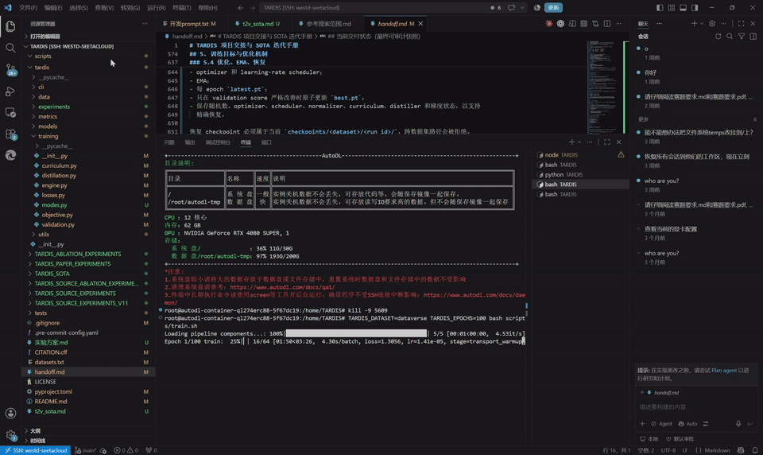
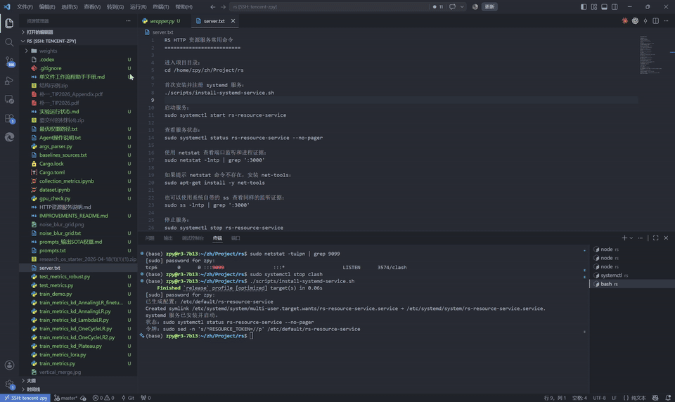
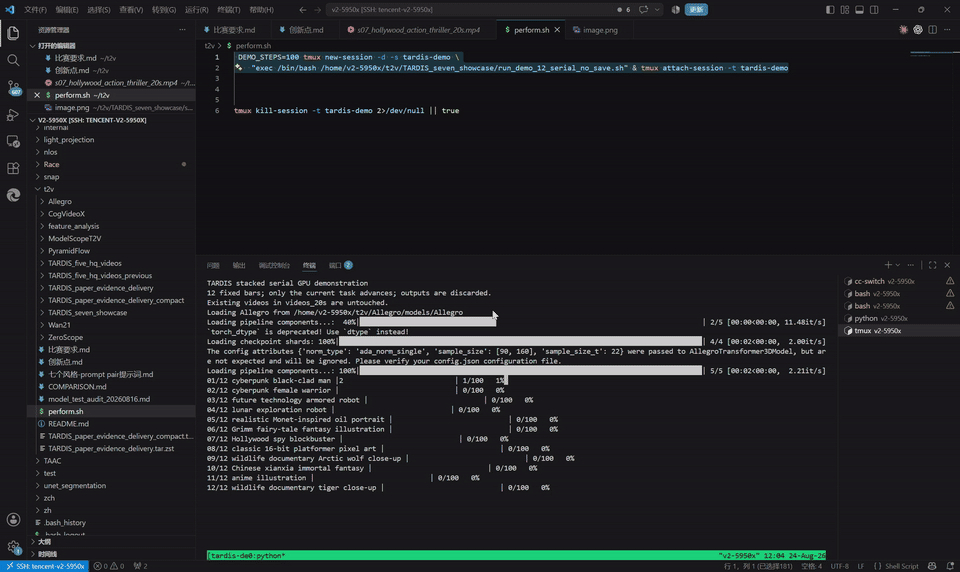
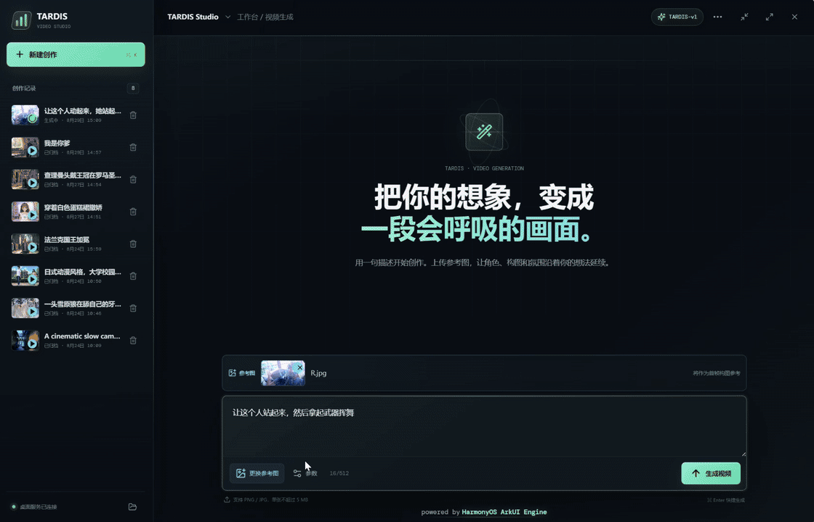
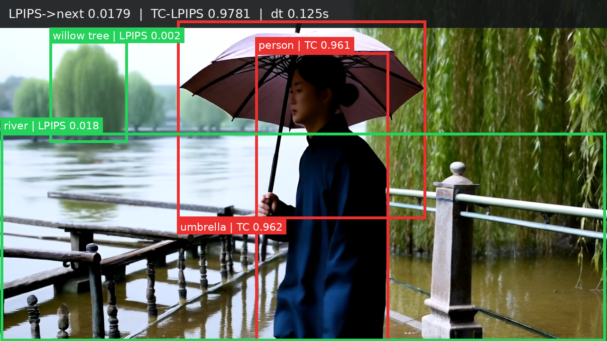
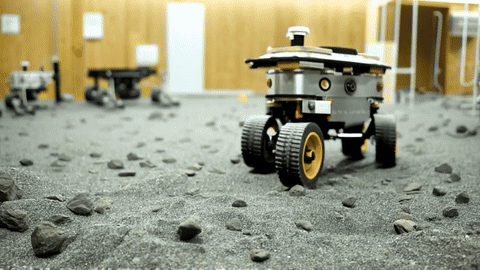

# TARDIS

## Transport-Aligned Residual Diffusion in Innovation Subspaces

TARDIS 是一个面向连续视频生成的完整工程：GPU 服务端负责训练、验证、评测和 prompt-only 推理；`web-server` 提供轻量 HTTP 服务和 nginx 前置，可作为 SSH 反向代理服务的运维前置；`tardis-client` 提供可在 Windows 上运行的 Electron 桌面创作客户端。

项目的核心原则是：

> 先传输可预测世界，再只扩散不可预测事件。

相邻视频帧中的背景、主体和纹理通常可以由历史状态和运动传输解释。TARDIS 先把上一帧生成状态对齐到当前坐标系，再在传输轨道的法向创新子空间中进行稀疏残差扩散，将预算集中到真正需要更新的区域。

本仓库是将原 `backbone_server` 内容提升到项目根目录后的统一交付版本。服务端代码现在位于根目录的 `tardis/`、`scripts/`、`tests/` 等目录中；没有保留空的 `backbone_server/` 壳目录。

## 实机演示

以下 GIF 是从交付目录中的真实录屏 MP4 截取的短片段，均标记为客户端/服务端演示结果。GIF 仅用于 README 展示，原始录屏仍保存在项目外的 `document_materials/perform/` 中。

| 训练与服务端 | Web/SSH 反向代理服务 | 推理评测 |
| --- | --- | --- |
|  |  |  |

桌面端创作流程（参考图预览、提交、轮询和结果归档）：



客户端静态演示截图：

| 参考图与参数 | 生成中 | 生成结果与归档 |
| --- | --- | --- |
|  |  |  |

演示素材索引：

| 原始素材（交付目录外） | README 展示副本 |
| --- | --- |
| `document_materials/perform/train.mp4` | `docs/demo/runtime/training-console.gif` |
| `document_materials/perform/web_server.mp4` | `docs/demo/runtime/web-bridge.gif` |
| `document_materials/perform/infer.mp4` | `docs/demo/runtime/inference-console.gif` |
| `document_materials/perform/TARDIS_Client_Demo_Results/` | `docs/demo/client/` |
| `document_materials/perform/videos_20s/*.mp4` | `docs/demo/batch/gif/*.gif` |

原始 MP4 和客户端演示截图保留在交付资料目录中；仓库只保留压缩后的 GIF、PNG 和 JPG，避免把大文件写入源码仓库。批量视频的 prompt 与文件名对应关系见交付资料中的 `videos_20s/description/12_video_prompts.txt`。

## 系统总览

仓库包含两条彼此独立的运行链路。桌面创作链路面向在线视频生成，使用客户端内置的 Express 代理访问 TARDIS 推理服务端；GPU 研究链路面向 TARDIS 的训练、评测和 prompt-only 推理，直接运行根目录下的 Python CLI。`web-server` 是可选的 HTTP/运维前置，不是当前客户端的生成 API，也不包含 GPU 推理代码。

```
桌面创作链路（在线视频 API）
┌──────────────────────────┐   loopback :8787   ┌────────────────────────────┐
│ tardis-client (Electron) │ ─────────────────> │ tardis-client/server        │
│ prompt / reference /     │                    │ Express proxy              │
│ polling / player /       │ <───────────────── │ API key kept server-side   │
│ local archive            │   video + status   └──────────────┬─────────────┘
└──────────────────────────┘                                  │ HTTPS
                                                               ▼
                                                    TARDIS 推理服务端 API

GPU 研究链路（本地或远端 GPU）
┌───────────────────────┐   ┌──────────────────────────┐   ┌─────────────────────┐
│ scripts/train.sh      │──>│ tardis.cli.train         │──>│ checkpoints + logs  │
│ scripts/infer.sh      │──>│ tardis.cli.infer         │──>│ metrics + showcases │
│ scripts/apply.sh      │──>│ tardis.cli.apply         │──>│ MP4 + JSON          │
└───────────────────────┘   │ frozen prior + TARDIS    │   └─────────────────────┘
                            │ TAR / TOQ / IRF-DIS / CIOD│
                            └──────────────────────────┘

可选 SSH 反向代理服务/运维层
┌──────────────────────┐       ┌──────────────┐
│ web-server :8080     │ <──── │ nginx :80    │
│ static / health /    │       │ proxy_pass   │
│ info / metrics /     │       └──────────────┘
│ admin (Basic Auth)   │
└──────────────────────┘
```

### 三个工程边界

| 组件 | 目录 | 作用 | 默认入口 |
| --- | --- | --- | --- |
| TARDIS GPU 引擎 | 根目录 `tardis/`、`scripts/` | 训练、验证、全量评测、prompt-only 生成 | `bash scripts/train.sh`、`infer.sh`、`apply.sh` |
| SSH 反向代理服务与前置服务 | `web-server/` | JDK 17 HTTP 服务、静态资源、健康检查、指标、限流、Basic Auth、nginx 反代；不提供 `/api/generations` | `scripts/start.ps1` 或 Docker Compose |
| 桌面客户端 | `tardis-client/` | prompt、参考图、进度轮询、播放、创作记录和本地归档 | `npm run desktop:dev` 或打包 EXE |

服务端本体是 GPU 上的 Python CLI/推理引擎，不是 FastAPI/Flask 常驻 HTTP API。客户端的生成请求由 `tardis-client/server` 直接转发到 TARDIS 推理服务端的异步接口；`web-server` 只承担静态资源和运维接口。若云端部署需要长期 HTTP 入口或反向 SSH 通道，应在部署环境中额外配置受限隧道，并明确映射到实际 API 服务。

## TARDIS 方法

TARDIS 将时序生成拆成两个互补部分：

1. **TAR（Transport-Aligned Residualization）**：从文本和因果状态预测运动，传输上一帧 latent、短期状态和 anchor，并构造当前帧相对于 transport prior 的残差。
2. **DIS（Diffusion in Innovation Subspaces）**：通过可见性校准的创新风险路由器选择 active patch，将残差投影到 transport orbit 的法向子空间，仅对风险区域的创新 token 运行稀疏 residual DiT。

推理闭环：

```
prompt
  -> frozen text encoder / TARDIS first-frame prior
  -> frame 0
  -> prompt-conditioned motion scaffold
  -> motion/state transport
  -> transport-orbit quotient projector
  -> innovation risk field + proper time
  -> lite tangent corrector + sparse normal residual diffusion
  -> causal state update
  -> next frame
```

主要模块位于 `tardis/models/`：

| 模块 | 责任 |
| --- | --- |
| `priors.py` | 冻结 VAE、文本编码器和首帧图像先验 |
| `motion.py` | source-motion teacher 与 prompt-conditioned motion scaffold |
| `transport.py` | latent warp、visibility 加权、历史状态传输 |
| `quotient.py` | transport Jacobian 轨道、tangent/normal 残差分解 |
| `router.py`、`clock.py` | 创新风险、active patch 和事件时间预算 |
| `residual.py` | lite tangent corrector 与 sparse residual DiT |
| `state.py` | causal state、anchor、scene-cut reset 和长期记忆 |
| `tardis.py`、`factory.py` | 主模型编排与 checkpoint-compatible 装配 |

训练目标同时包含官方 TC、LPIPS、残差扩散、transport、flow/visibility、router、drift、文本和因果创新算子蒸馏项。完整默认值见 `scripts/train.sh` 和 `docs/train.md`。

## 项目结构

```
project/
├── tardis/                  # TARDIS Python package
│   ├── cli/                  # train / infer / apply / runtime
│   ├── data/                 # dataset contracts, manifest, archive, split
│   ├── models/               # TAR, TOQ, IRF/DIS, state updater
│   ├── training/             # objective, losses, curriculum, EMA, distill
│   ├── metrics/              # TC, LPIPS, FVD, FID, CLIPScore, SSIM
│   ├── experiments/          # benchmarks, ablations, diagnostics, reports
│   └── utils/                # checkpoint, video I/O, resources, randomness
├── scripts/                  # deployment-oriented shell entry points
├── docs/                     # train/infer/apply/dataset documentation
│   └── demo/                 # README GIFs and selected visual evidence
├── tests/                    # unit and integration tests
├── data/                     # .gitkeep only; large datasets stay on data disk
├── checkpoints/              # .gitkeep only; large weights stay on data disk
├── outputs/                  # .gitkeep only; generated outputs stay on data disk
├── web-server/               # JDK HTTP service and nginx configuration
├── tardis-client/            # Electron + React desktop application
├── datasets.txt              # canonical dataset roots (edit per machine)
├── pyproject.toml            # Python package and dependency contract
├── CITATION.cff              # citation metadata
└── LICENSE                   # Apache License 2.0 for project code
```

## 数据集与 benchmark

项目内部固定使用三个 canonical dataset 名称：

| canonical name | 上游数据源 | 默认 manifest root |
| --- | --- | --- |
| `dataverse` | Vchitect T2V DataVerse | `Vchitect_T2V_DataVerse` |
| `openvid` | OpenVid-1M | `OpenVid-1M` |
| `seedance` | seedance-2-prompts-datasets | `seedance-2-prompts-datasets` |

默认 `datasets.txt` 中记录的是：

```
/home/TARDIS/data/Vchitect_T2V_DataVerse
/home/TARDIS/data/OpenVid-1M
/home/TARDIS/data/seedance-2-prompts-datasets
```

部署到其他机器时，推荐复制路径文件并设置 `TARDIS_DATASETS_FILE`，不要把大规模视频复制进 Git。标准 split 使用 train/validation/test 三段，默认 split seed 为 `3407`；记录数和 manifest 版本应以目标数据盘上的 `tardis_manifest.jsonl` 与 `curation_report.json` 为准。

正式 benchmark 设置是 **3 个数据集、TARDIS 与 9 个外部对比基线**：

| # | 方法标识 | 备注 |
| ---: | --- | --- |
| 1 | `external_baseline_01` | TARDIS 推理服务端外部基线 01 |
| 2 | `external_baseline_02` | TARDIS 推理服务端外部基线 02 |
| 3 | `external_baseline_03` | TARDIS 推理服务端外部基线 03 |
| 4 | `external_baseline_04` | TARDIS 推理服务端外部基线 04 |
| 5 | `external_baseline_05` | TARDIS 推理服务端外部基线 05 |
| 6 | `external_baseline_06` | TARDIS 推理服务端外部基线 06 |
| 7 | `external_baseline_07` | TARDIS 推理服务端外部基线 07 |
| 8 | `external_baseline_08` | TARDIS 推理服务端外部基线 08 |
| 9 | `external_baseline_09` | TARDIS 推理服务端外部基线 09 |

后六类通常属于 source-conditioned 对比，不能与 prompt-only `apply` 结果混写。实现和分组位于 `tardis/experiments/benchmark.py`；论文视觉包中的对照来源索引见 [docs/demo/model_sources.txt](docs/demo/model_sources.txt)。

## GPU 服务端部署

### 环境

- Linux + NVIDIA CUDA GPU；训练和推理默认使用 `bf16`。
- Python `>=3.12`。
- PyTorch `>=2.8,<2.9`，以及 `diffusers`、`transformers`、`accelerate`、`torchvision`、`av`、`opencv-python-headless`、`lpips`、`open-clip-torch`、`torchmetrics` 等。
- 可访问模型缓存和数据盘；默认基础先验由 TARDIS 推理服务端提供。

安装：

```bash
cd /path/to/project
python3.12 -m venv .venv
source .venv/bin/activate
python -m pip install --upgrade pip
python -m pip install -e .
```

研究/代码质量依赖：

```bash
python -m pip install -e '.[dev]'
```

### 数据盘和缓存

```bash
export TARDIS_STORAGE_ROOT=/root/autodl-tmp/TARDIS
export TARDIS_DATASETS_FILE=/path/to/project/datasets.txt
export TARDIS_CHECKPOINT_ROOT="$TARDIS_STORAGE_ROOT/checkpoints"
export TARDIS_OUTPUT_ROOT="$TARDIS_STORAGE_ROOT/outputs"
export HF_HOME="$TARDIS_STORAGE_ROOT/cache/huggingface"
export TORCH_HOME="$TARDIS_STORAGE_ROOT/cache/torch"
```

默认脚本会设置 `HF_ENDPOINT=https://hf-mirror.com` 和 `HF_HUB_DISABLE_XET=1`；正式实验应记录 manifest、checkpoint SHA-256、模型签名、分辨率、帧数、采样步数、精度和 GPU 型号。

### 训练

标准入口通过脚本位置推导根目录，提升服务端内容后不需要额外改路径：

```bash
cd /path/to/project
source .venv/bin/activate
TARDIS_DATASET=dataverse bash scripts/train.sh
```

切换数据集：

```bash
TARDIS_DATASET=openvid bash scripts/train.sh
TARDIS_DATASET=seedance bash scripts/train.sh
```

常用覆盖项：

```bash
TARDIS_EPOCHS=20 \
TARDIS_STEPS_PER_EPOCH=64 \
TARDIS_MICRO_BATCH_SIZE=2 \
TARDIS_GRADIENT_ACCUMULATION_STEPS=2 \
TARDIS_NUM_FRAMES=16 \
TARDIS_DIFFUSION_STEPS=2 \
TARDIS_ACTIVE_RATIO=0.35 \
bash scripts/train.sh
```

训练在 validation 上使用 TC/LPIPS 选择 `best.pt`，并保存 `latest.pt`、日志和统计；test 指标不参与 checkpoint 选择。

### 全量推理评测

```bash
TARDIS_DATASET=dataverse \
TARDIS_CHECKPOINT=/root/autodl-tmp/TARDIS/checkpoints/dataverse/<run>/best.pt \
bash scripts/infer.sh
```

`infer` 针对一个数据集完整 test split 生成指标和固定数量 showcase：

```
outputs/infer/<dataset>/<timestamp>/
├── metrics.xlsx / metrics.csv
├── per_video_details.csv / per_video_details.jsonl
├── failures.jsonl
├── latency.json / resources.json
└── showcases/*.mp4
```

主指标为官方 TC 和 LPIPS；FVD、FID、CLIPScore、SSIM、warp error、长序列 drift 与延时统计用于诊断。只有在同一协议、同一数据划分和同一硬件上比较时，才应把数字写成性能结论。

### Prompt-only 生成

`apply` 不读取 source video，仅由 prompt 和首帧 prior 启动因果 rollout：

```bash
TARDIS_DATASET=dataverse \
TARDIS_CHECKPOINT=/root/autodl-tmp/TARDIS/checkpoints/dataverse/<run>/best.pt \
TARDIS_PROMPT='A small robot walks through a misty bamboo forest at sunrise' \
TARDIS_STYLE=cinematic \
TARDIS_DURATION=2 \
bash scripts/apply.sh
```

输出：

```
outputs/apply/<dataset>/<timestamp>/video.mp4
outputs/apply/<dataset>/<timestamp>/video.json
```

不要把 `apply` 的 prompt-only 输出写成 source-conditioned video editing。

## Web-server 与 SSH 反向代理服务

`web-server/` 是 JDK 17 HTTP 服务，提供静态文件、健康检查、服务器信息、运行时指标、CORS、按 IP 限流和 Basic Auth 管理接口。nginx 配置将公网 80 端口反代到应用 8080 端口。

要求 JDK 17+、Maven 3.8+：

```powershell
cd web-server
.\scripts\start.ps1
```

脚本默认执行 `mvn package` 后启动 `target/tardis-webserver.jar`；需要跳过测试构建时：

```powershell
.\scripts\start.ps1 -SkipTests
```

Linux/macOS 等价命令：

```bash
cd web-server
mvn package
java -jar target/tardis-webserver.jar
```

默认监听 `0.0.0.0:8080`。Docker + nginx：

```bash
cd web-server
docker compose up --build
```

HTTP 接口：

| 接口 | 作用 |
| --- | --- |
| `GET /` | 静态首页 |
| `GET /api/health` | 健康状态 |
| `GET /api/info` | 服务信息 |
| `GET /api/metrics` | 请求计数、活跃请求和按路径统计 |
| `GET /admin/info` | Basic Auth 管理信息 |
| `GET /admin/metrics` | 受保护的运行时指标 |

仓库中的 JDK 服务本身不包含 GPU 推理逻辑。若部署环境将它作为 SSH 反向代理服务的 HTTP 前置，运维层可以建立受限隧道：

```bash
ssh -N -T \
  -o ExitOnForwardFailure=yes \
  -R <gateway-port>:127.0.0.1:8080 \
  <user>@<gateway-host>
```

端口、用户、密钥和绑定地址必须按安全组和 SSH 策略配置；不要把管理接口或 SSH 私钥暴露到公网。`nginx.conf` 中的 `proxy_pass` 目标也应按实际隧道端口修改。

## TARDIS Studio 桌面客户端

客户端是 Electron + React + Vite 应用，支持：

- prompt 必填，最多 512 个字符；
- PNG/JPG/JPEG 参考图上传，并在对话框上方即时预览；
- 画幅、时长、FPS、质量和音效选项；
- 异步任务提交与 `/api/generations/:id` 轮询进度；
- 完成后在桌面窗口内播放视频；
- 侧边栏创作记录；
- 下载视频、封面和 `manifest.json` 到本地归档；
- Electron `safeStorage` 保存 API Key，渲染层不接触明文密钥。

开发运行：

```powershell
cd tardis-client
npm install
npm run desktop:dev
```

只调试网页界面时可使用 `npm run dev`；完整桌面链路使用 `desktop:dev`。

服务端 API 密钥只应放在本机环境变量或客户端设置面板中：

```powershell
$env:TARDIS_INFERENCE_API_KEY = '<your-service-key>'
npm run desktop:dev
```

客户端本地 Express 代理默认监听 `127.0.0.1:8787`，代理将异步请求发送到 TARDIS 推理服务端的视频接口。渲染层只访问本地代理，不直接持有服务端密钥。

构建桌面包：

```powershell
npm run build
npm run desktop:dist
```

Windows 产物位于 `tardis-client/release/win-unpacked/`，可直接启动 `TARDIS Studio.exe`。本地归档默认位于 `%APPDATA%\\tardis-video-studio\\archives`，可用 `TARDIS_ARCHIVE_DIR` 覆盖。

客户端 API 契约：

```http
POST http://127.0.0.1:8787/api/generations
Content-Type: application/json
```

```json
{
  "prompt": "A cinematic robot walks through a rainy neon street",
  "imageData": "data:image/png;base64,...",
  "settings": {
    "quality": "speed",
    "size": "1280x720",
    "fps": 30,
    "duration": 5,
    "withAudio": false
  }
}
```

创建任务后轮询：

```http
GET http://127.0.0.1:8787/api/generations/<task-id>
```

终态为 `PROCESSING`、`SUCCESS` 或 `FAIL`。云端 `videoUrl`/`coverUrl` 是临时地址，客户端成功后会立即下载到本地归档。完整字段约束见 [tardis-client/server/API_CONTRACT.md](tardis-client/server/API_CONTRACT.md)。

## 生成效果展示

### 同一 prompt 的模型对照与多场景补充

以下 clean 帧来自论文精简证据包，统一为 1280×720 画布；它们用于展示视觉风格和时序质量，不替代正式数值评测。`TARDIS` annotated 副本保留人物/物体/场景框和 LPIPS/TC 解释标签。展示样例改用未在 README 前版出现的 `s13_gongbi_river_umbrella`、`s12_scifi_astronaut_capsule` 和 `s14_pencil_cafe`。

| TARDIS clean: gongbi river | TARDIS annotated: gongbi river |
| --- | --- |
|  |  |

| TARDIS clean: astronaut capsule | TARDIS annotated: astronaut capsule |
| --- | --- |
|  |  |

| TARDIS clean: pencil cafe | TARDIS annotated: pencil cafe |
| --- | --- |
|  |  |

同一 `s13_gongbi_river_umbrella` 条件下的外部 T2V clean 帧：

| TARDIS 推理服务端 / 外部基线 A | TARDIS 推理服务端 / 外部基线 B | TARDIS 推理服务端 / 外部基线 C | TARDIS 推理服务端 / 外部基线 D | TARDIS 推理服务端 / 外部基线 E |
| --- | --- | --- | --- | --- |
|  |  |  |  |  |

五组对照素材的来源、权重和论文链接记录在 [docs/demo/model_sources.txt](docs/demo/model_sources.txt)。

### 12 个批量推理场景

下列 GIF 是从 `document_materials/perform/videos_20s/` 的 12 个批量推理 MP4 中截取的约 3 秒预览，用于展示赛博朋克、科幻机甲、月面实验室、油画、手绘森林、动作片、像素 RPG、野生动物、仙侠和日式动画等场景。它们统一压缩为 480px 宽、8 FPS 的 README 友好版本；原始 MP4 不复制进仓库。

| 场景 | GIF 预览 | 场景 | GIF 预览 | 场景 | GIF 预览 |
| --- | --- | --- | --- | --- | --- |
| Cyberpunk city |  | Rain alley |  | Sci-fi mecha |  |
| Lunar lab |  | Oil seaside |  | Fantasy forest |  |
| Action thriller |  | Pixel RPG |  | Arctic wolf |  |
| Xianxia cliff |  | Japan animation |  | Wildlife close-up |  |

## 输出、日志与可复现性

标准脚本将大型文件写入 `TARDIS_STORAGE_ROOT`：

```
$TARDIS_STORAGE_ROOT/
├── cache/{huggingface,torch,xdg}/
├── checkpoints/<dataset>/<run>/{latest.pt,best.pt}/
└── outputs/
    ├── train/<dataset>/<run>/
    ├── infer/<dataset>/<run>/
    └── apply/<dataset>/<run>/{video.mp4,video.json}
```

复现实验至少保存：数据集 revision、manifest hash、split seed；checkpoint SHA-256 和模型结构签名；分辨率、帧数、FPS、采样步数、precision、GPU；TC/LPIPS 实现版本、每视频明细和失败样例；首帧、steady-state、full-refresh 的 latency、p50/p95、峰值显存和 active ratio。

当前仓库不会把“平均 FPS”自动解释为逐帧实时保证。是否满足 FPS 目标必须在目标硬件上包含 motion、transport、quotient、VAE 和 I/O 的端到端实测。

## 研究实验脚本边界

`scripts/train.sh`、`infer.sh`、`apply.sh` 是迁移后可直接使用的标准入口；它们通过 `SCRIPT_DIR` 推导根目录。`scripts/run_*` 和 `tardis/experiments/` 下部分论文交付、benchmark、队列和审计脚本仍保留 `/home/TARDIS` 或 `/root/autodl-tmp/TARDIS` 的研究环境假设，运行前应检查并覆盖绝对路径。

论文/附录中的正式结果、抽帧图和代理指标来自独立证据包；README 中的 GIF 与缩略图是可视化演示，不应被当作全测试集统计。

## 故障排查

### 找不到数据或 manifest

```bash
cat "$TARDIS_DATASETS_FILE"
ls -lah /path/to/data-root/tardis_manifest.jsonl
```

确认 `TARDIS_DATASETS_FILE` 中的三个路径存在，并且每个源有 manifest、curation report 和媒体归档。

### 找不到 checkpoint

```bash
find "$TARDIS_CHECKPOINT_ROOT" -name best.pt -print
```

确保 `TARDIS_DATASET`、checkpoint 模型签名、分辨率、帧数、hidden size、层数和采样配置一致。

### CUDA out of memory

降低 `TARDIS_MICRO_BATCH_SIZE`、`TARDIS_VALIDATION_BATCH_SIZE`，提高梯度累计，保持 `TARDIS_GRADIENT_CHECKPOINTING=1`，并确认 VAE decode chunk 没有超过显存容量。改变网络结构后不能直接复用不匹配 checkpoint。

### Web-server 端口冲突

检查 `src/main/resources/application.properties` 的 `server.port`、nginx upstream 和 Docker 映射是否一致。不要同时启动 systemd、Docker 和手工 Java 进程，否则会争用 8080。

### 客户端无法轮询或下载

先检查本地 `127.0.0.1:8787` 代理，再确认服务端密钥有效、云端任务 ID 有效、临时视频 URL 尚未失效。客户端成功后应检查归档目录中的 `video.mp4`、`cover.jpg` 和 `manifest.json`。

## 安全与许可证

- 不要把 API Key、SSH 私钥、云端 token 或 `.env.local` 提交到仓库。
- 之前在聊天或日志中出现过的服务端密钥应立即轮换；README、截图和 GIF 不包含密钥。
- Web-server 默认 Basic Auth 凭据仅用于本地开发，生产环境必须改为强密码并限制管理接口来源。
- 项目代码采用 Apache License 2.0，见 [LICENSE](LICENSE)。数据集、基础模型、模型权重和第三方依赖遵循各自的许可证、访问政策和再分发限制。

## 引用与相关文档

若使用 TARDIS 代码或方法，请参考 [CITATION.cff](CITATION.cff)。论文实验的视觉来源和对照链接见 [docs/demo/model_sources.txt](docs/demo/model_sources.txt)。

- [docs/train.md](docs/train.md)：训练、验证和 checkpoint 选择
- [docs/infer.md](docs/infer.md)：全量 test split、指标和 showcase
- [docs/apply.md](docs/apply.md)：prompt-only causal rollout
- [docs/datasets.md](docs/datasets.md)：manifest、归档和数据划分
- 本 README 已汇总桌面客户端、JDK HTTP 服务、nginx、Docker 和 SSH 反向代理服务说明
- [docs/demo/](docs/demo/)：客户端演示结果、实机录屏 GIF、批量推理缩略图和视觉对比帧
